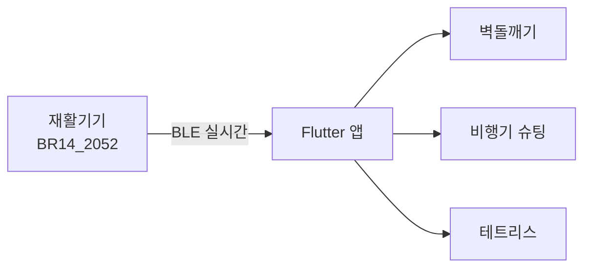

```console
$ whoami

정상명 · JeongSangMyeong
Spring Boot 로 시작해서, 지금은 필요한 걸 필요한 도구로 만듭니다.
앱(Flutter), 웹(Next.js), 서버(Spring Boot), 렌더링(Blender · Python).

$ cat ~/.principles

1. 만든 게 실제로 도는지 확인하고 말한다.
2. 안 되는 건 안 된다고 쓴다. README 는 광고가 아니다.
3. 틀렸으면 되돌린다.
```

<div align="center">


</div>

---

## 🖐 hand-rehab-game

**블루투스 재활기기로 조작하는 게임 앱.** 손가락 압력과 손목 기울임이 그대로 게임 입력이 됩니다.

▶︎ **[시연 영상](https://youtu.be/1YC9MNHcwRc)** — 뇌가소성 재활기기 실제 동작



- 특정 장치 자동 검색·연결, 끊기면 재연결
- 자이로 · 가속도 · 압력 스트림을 게임 조작으로 변환
- 게임별 난이도·속도 설정 화면

`Flutter` `Dart` `BLE` → **[저장소](https://github.com/JeongSangMyeong/hand-rehab-game)**

---

## 🎙 voice-record

**녹음을 텍스트로 바꾸는 도구. 녹음 파일이 기기 밖으로 나가지 않습니다.**

브라우저 안에서 Whisper 를 WASM 으로 돌립니다. 서버가 없으니 업로드도 없습니다.

```console
$ 어디서 도는가
웹(휴대폰)   그 기기 안       서버 없음    주소만 열면 끝
PC 프로그램   그 PC 안         서버 없음    더블클릭 한 번
웹 서버판     서버로 업로드     서버 필요    배포 후 사용
```

만들면서 한 번 되돌렸습니다 — 다른 엔진으로 바꿨다가, 실제 회의 녹음으로 다시 재 보니
읽기 어려운 결과가 나와서 Whisper 로 복귀시켰습니다.

`Whisper` `WebAssembly` `SharedArrayBuffer` → **[저장소](https://github.com/JeongSangMyeong/voice-record)**

---

## 🔍 naver-search

**네이버 오픈 API 6종을 한 화면에서 검색.** 블로그 · 뉴스 · 책 · 카페 · 지식인 · 지역.

검색 유형마다 응답 필드가 달라서, 표 컬럼을 설정으로 분리하고 유형이 바뀌면 표가 통째로 갈리게 했습니다.
클라이언트 시크릿은 서버 라우트에서만 읽습니다.

`Next.js 14` `App Router` `TypeScript` → **[저장소](https://github.com/JeongSangMyeong/naver-search)**

---

## 📷 Spring-boot-Photogram

**인스타그램 클론.** 피드 · 좋아요 · 댓글 · 팔로우 · OAuth2 로그인.

클론 코딩으로 시작해서, 강의 코드에 있던 버그를 직접 잡고 기능을 붙였습니다.
무엇이 강의고 무엇이 제 작업인지는 [README](https://github.com/JeongSangMyeong/Spring-boot-Photogram#직접-구현한-부분)에 커밋 해시까지 적어 뒀습니다.

`Spring Boot 3.3.5` `Java 21` `JPA` `Spring Security` `MariaDB` → **[저장소](https://github.com/JeongSangMyeong/Spring-boot-Photogram)**

---

## 진행 중 <sub>(비공개)</sub>

```console
$ ls ~/now

qtag/          제품에 붙이는 QR 스티커 → 판매 페이지 연결.
               판매 사이트 없는 곳을 위한 페이지 빌더 포함.
               Next.js · Supabase

crave-video/   POS 단말기 제품 홍보영상.
               Creo STEP 원본을 Blender 로 렌더링해 편집.
               Blender · Python
```

---

<div align="center">

📫 **ajflsp@naver.com**

</div>
