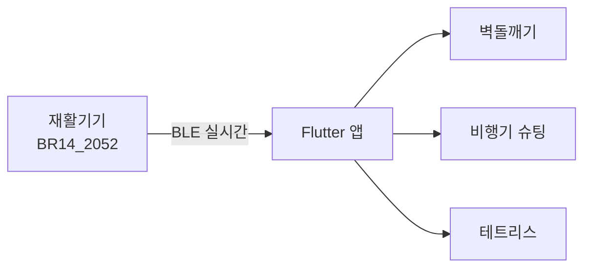
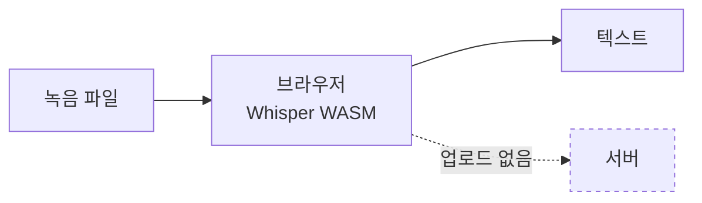

```ts
const jsm = {
  name: '정상명',
  started: 'Spring Boot / Java',
  building: ['qtag', 'crave-video'],
  writesIn: ['Dart', 'TypeScript', 'Java', 'Python'],
  email: 'ajflsp@naver.com',
}
```

<div align="center">


</div>

---

## 🖐 hand-rehab-game

**블루투스 재활기기로 조작하는 게임 앱.** 손가락 압력과 손목 기울임이 그대로 게임 입력이 됩니다.

▶︎ **[시연 영상](https://youtu.be/1YC9MNHcwRc)** · 뇌가소성 재활기기 실제 동작



- 특정 장치 자동 검색·연결, 끊기면 재연결
- 자이로 · 가속도 · 압력 스트림을 게임 조작으로 변환
- 게임별 난이도·속도 설정 화면

`Flutter` `Dart` `BLE` → **[저장소](https://github.com/JeongSangMyeong/hand-rehab-game)**

---

## 🎙 voice-record

**녹음을 텍스트로 바꿉니다.** 브라우저 안에서 Whisper 를 WASM 으로 돌리기 때문에 녹음 파일이 기기 밖으로 나가지 않습니다.



- 웹 · PC 프로그램 · 서버판 3가지로 제공
- 조용한 구간을 버리지 않고 전체를 덮도록 구간 분할
- `SharedArrayBuffer` 를 쓰려고 cross-origin isolation 처리

엔진을 SenseVoice 로 바꿨다가 실제 회의 녹음으로 다시 재보고 Whisper 로 되돌렸습니다.

`Whisper` `WebAssembly` `PWA` → **[저장소](https://github.com/JeongSangMyeong/voice-record)**

---

## 🔍 naver-search

**네이버 오픈 API 6종을 한 화면에서 검색합니다.** 블로그 · 뉴스 · 책 · 카페 · 지식인 · 지역.

유형마다 응답 필드가 달라서 표 컬럼을 설정으로 분리했습니다. 유형을 바꾸면 표가 통째로 갈립니다.

```ts
// pages/api/search.js — 시크릿은 서버에서만 읽습니다
const ALLOWED_API_TYPES = ['blog', 'news', 'book', 'cafearticle', 'kin', 'local']

if (!ALLOWED_API_TYPES.includes(apiType)) {
  return res.status(400).json({ message: `지원하지 않는 검색 유형입니다: ${apiType}` })
}

headers: {
  'X-Naver-Client-Id':     process.env.NAVER_CLIENT_ID,
  'X-Naver-Client-Secret': process.env.NAVER_CLIENT_SECRET,
}
```

`Next.js 14` `App Router` `TypeScript` → **[저장소](https://github.com/JeongSangMyeong/naver-search)**

---

## 📷 Spring-boot-Photogram

**인스타그램 클론.** 피드 · 좋아요 · 댓글 · 팔로우 · OAuth2 로그인.

클론 코딩으로 시작했습니다. 강의 코드에 있던 버그를 잡고 기능을 붙인 부분은
[README](https://github.com/JeongSangMyeong/Spring-boot-Photogram#직접-구현한-부분)에 커밋 해시까지 적어 뒀습니다.

- 회원정보 변경 버튼이 `/user/1/update` 로 고정돼 있던 것 수정
- 컨트롤러마다 흩어진 `BindingResult` 처리를 AOP 로 통합
- 좋아요 기능의 JPA 무한 참조 해결

`Spring Boot 3.3.5` `Java 21` `JPA` `Spring Security` `MariaDB` → **[저장소](https://github.com/JeongSangMyeong/Spring-boot-Photogram)**

---

## 진행 중 <sub>(비공개)</sub>

**qtag** · 제품에 QR 스티커를 붙여 판매 페이지로 연결합니다. 판매 사이트가 없는 곳을 위한 페이지 빌더를 넣었습니다.
`Next.js` `Supabase`

**crave-video** · POS 단말기 제품 홍보영상. Creo STEP 원본을 Blender 로 렌더링해 편집했습니다.
`Blender` `Python`
